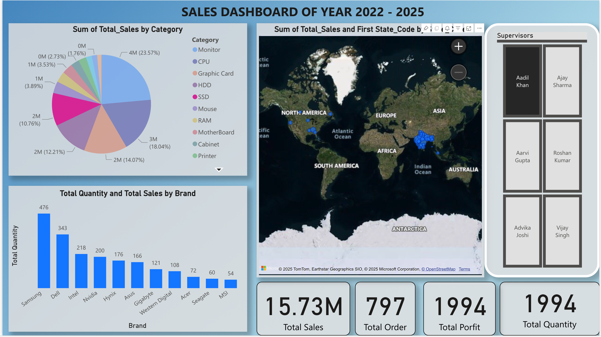

# 📊 **Sales Dashboard (2022 – 2025)**

This project is a fully-interactive **Sales Analytics Dashboard** designed in **Power BI** to visualize multi-year business performance.  
It helps businesses monitor sales trends, product performance, inventory movement, and supervisor performance in real-time.

---

## ✅ **Dashboard Overview**

The dashboard provides:

- Category-wise sales contribution
- Geographic sales distribution (Map)
- Brand-wise total quantity & revenue comparison
- Top performing supervisors (tile slicer)
- Key Sales KPIs (Sales, Orders, Profit, Quantity)

It is built for managers and analysts who want powerful insights instantly.

---

## 🧠 **Business Questions Answered**

✔️ Which product categories generate the most revenue?  
✔️ Which brand sells the most quantity?  
✔️ Which regions drive higher revenue?  
✔️ Which supervisors perform best?  
✔️ How many orders, profit & quantity are being processed?

---

## 🖥️ **Dashboard Preview (Desktop View)**



> *(Replace image with your actual screenshot file name)*

---

## 📱 **Mobile View (Phone Screenshot)**

This dashboard is also optimized for mobile view using Power BI's **Phone Layout Mode**.


> *(Add your mobile screenshot here — ensures visual access on smartphones)*

---

## 🔍 **Key Visuals Used**

| Feature | Visualization |
|--------|---------------|
| Category Sales | Pie Chart |
| Geographic Distribution | Map |
| Brand Comparison | Bar Chart |
| Supervisor Performance | Tile Slicer |
| KPIs | Card Visual |

---

## 🛠️ **Tools & Technology Used**

- Power BI Desktop
- Power Query (ETL)
- DAX (Measures & Calculations)
- Data Modelling
- Excel (Source Dataset)

---

## 🧩 **Data Fields Used**

### Product
- Category  
- Brand  
- Quantity  
- Total Sales  
- Profit  
- Order ID  

### Geography
- Country  
- State  

### Supervisors
- Supervisor Name  
- Team Group  

---

## 🗄️ **Data Model Design**

The model follows a **Star Schema**:

**Fact Table:**
- FactSales  
  - Sales Amount
  - Quantity
  - Profit
  - Order ID  

**Dimension Tables:**
- DimProduct
- DimCustomer
- DimSupervisor
- DimGeography

---

## 🧮 **Custom DAX Measures**

```DAX
Total Sales = SUM(Sales[Total_Sales])

Total Orders = DISTINCTCOUNT(Sales[Order_ID])

Total Quantity = SUM(Sales[Quantity])

Total Profit = SUM(Sales[Profit])
# Sales_Dashboard
